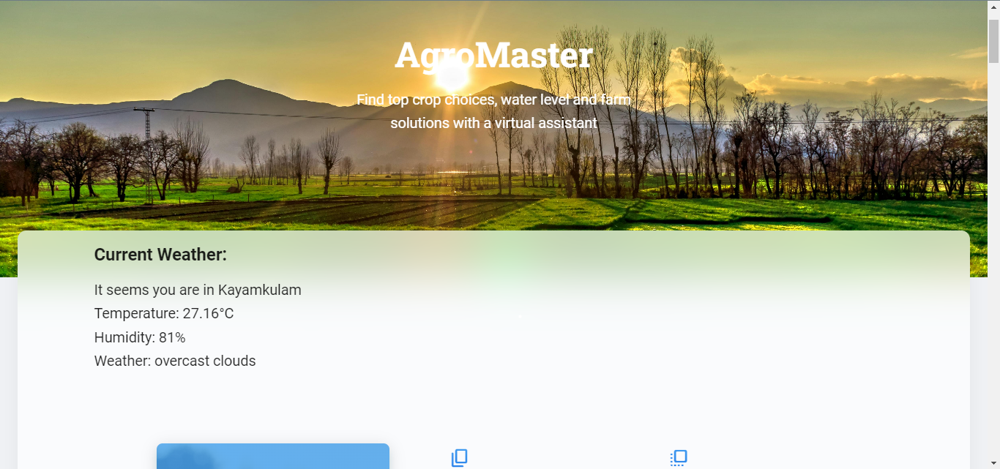

# AgroMaster - A Complete Farming Solution 🌾

This backend project is a part of NASA Space Apps Challenge 2024. The frontend of this project on another member github.
Website: [AgroMaster](https://frontend-onh3.vercel.app/)

AgroMaster is a smart farming assistant designed to provide real-time, data-driven recommendations to farmers using NASA Earthdata and advanced APIs. This backend service handles fetching environmental data based on user location, providing crop suggestions, and integrating with multiple APIs, such as weather, soil moisture, and crop prediction.

## Features 🚀
- 🌍 Location-Based Farming Recommendations: Get crop suggestions based on location, weather, and date using NASA data and AI models.
- 🌦️ Weather Data Integration: Real-time weather data from a free API is used to assess farming conditions.
- 🌱 Crop Prediction: Recommendations for crop planting are based on the weather and soil conditions.
- 🗺️ NASA Earthdata APIs: Fetch and process soil moisture, water levels, and vegetation data using NASA's geospatial datasets.
- 🧠 Google Gemini API Integration: AI-powered crop suggestions based on current conditions and user inputs.
- 🔄 Text-to-Speech: Convert crop suggestions into voice.
